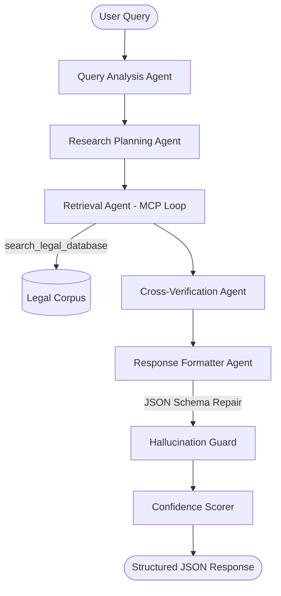

# 🏛️ Legal Research AI: Advanced Multi-Agent Orchestration Engine

[](https://www.python.org/)
[](https://fastapi.tiangolo.com/)
[](https://groq.com/)
[](https://modelcontextprotocol.io/)

> **A next-generation structured research engine for legal professionals. Built with agentic precision, zero-hallucination guards, and deterministic confidence scoring.**

---

## � The Problem & Our Solution

**The Problem**: Standard AI models (like ChatGPT) often "hallucinate" legal sections, citing laws that don't exist or misinterpreting landmark cases—a critical risk for legal professionals.

**Our Solution**: **Legal Research AI** uses a strict **Model Context Protocol (MCP)** loop. It doesn't just "chat"; it performs a 7-stage research workflow where every single claim is cross-verified against a verified legal corpus (`dataset.json`) and a dedicated "Hallucination Guard" agent.

---

## 🏗️ Architecture: The Multi-Agent Workflow

The engine uses a linear orchestration of specialized agents. Each agent is responsible for one specific task in the research pipeline.



---

## 🚀 Key Features

*   **🛡️ Hallucination Guard**: A final validation layer that uses regex and text-matching to remove any LLM claims not supported by the retrieved documents.
*   **🛠️ Self-Healing JSON Engine**: Features a unique `_validate_and_repair_schema` logic that automatically "heals" broken LLM outputs to guarantee 100% API contract compliance.
*   **📊 Deterministic Confidence Scoring**: Scores (30–95) are calculated mathematically based on source density, conflict detection, and retrieval quality.
*   **⚡ Groq-Powered Inference**: Leveraging Llama 3.1 70B for high-speed, sub-2-second research cycles.
*   **💾 Deep Context Memory**: The `MemoryService` persists full research logs, allowing the AI to "remember" complex legal arguments across multi-turn sessions.

---

## 📂 Project Structure

```text
LegalResearchAI/
├── src/
│   ├── ai/
│   │   ├── mcp_orchestrator.py   # The "Brain" (Agent Orchestration)
│   │   ├── hallucination_guard.py # Truth-Verification Logic
│   │   ├── retriever_service.py   # MCP Tool Execution
│   │   ├── confidence_scorer.py   # Mathematical Scoring Logic
│   │   ├── dataset.json           # Verified Source of Truth (IPC, CrPC)
│   │   └── memory_service.py      # Session & Result Persistence
│   ├── api_models.py              # Pydantic Schema Contracts
│   └── main.py                    # FastAPI Entry Point
├── README.md                      # Project Documentation
└── requirements.txt               # Dependencies
```

---

## ⚙️ Setup & Installation

1. **Clone & Navigate**
   ```bash
   git clone https://github.com/Raghav1378/Legal-AI.git
   cd LegalResearchAI
   ```

2. **Environment Setup**
   ```bash
   python -m venv venv
   source venv/bin/activate  # Or `.\venv\Scripts\activate` on Windows
   pip install -r requirements.txt
   ```

3. **Configure API Keys**
   Add your `GROQ_API_KEY` to `src/ai/.env`.

---

## 🧪 Production Hardening (Tests)

The system includes a heavy-duty hardening suite that validates everything from metadata accuracy to hallucination removal.

```bash
# Run the 8-stage verification suite
$env:PYTHONPATH="src"
python -m ai.verify_orchestration
```

---

## 👤 About the Developer

**Raghav**
*   **GitHub**: [@Raghav1378](https://github.com/Raghav1378)
*   **Role**: Lead Architect & Developer
*   **Vision**: Bridging the gap between LLM creativity and Legal accuracy through Agentic Workflows.

---
*Created with ❤️ for the Indian Legal Community.*
